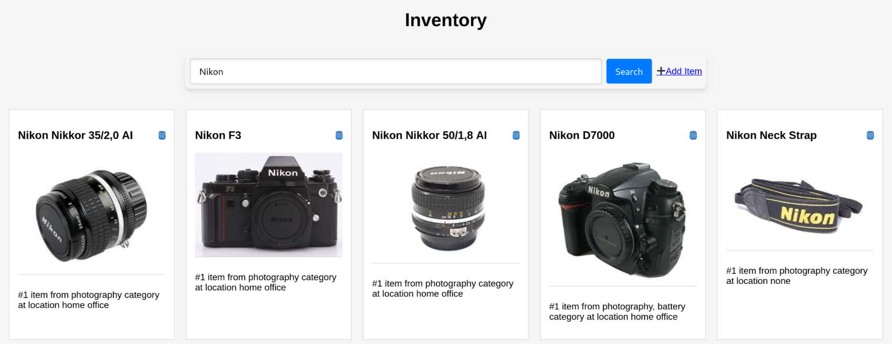

# inven
Keep track of all your stuff from the command line. Manage your physical belongings with `inven` 📦📜

Example view in browser when running `inven serve`:


## Installation

Build and installation requirements:
- GHC
- Stack

```sh
git clone https://github.com/mo42/inven.git && cd inven
stack install
```

If you have `.local/bin` in your PATH environment variable, you should be able
to run the `inven` command.

### Docker

You can create a Docker image by running `docker build -t inven-app`.

To have a persistent state, I use the volume option to mount the directory from the host:
```sh
docker run -p 4200:4200 \
    -v ~/.local/share/inven:/home/invenuser/.local/share/inven:rw,Z
    inven-app
```

## Usage

```
$ inven --help
Usage: inven COMMAND

Available options:
  -h,--help                Show this help text

Available commands:
  add                      Add an item
  find                     Find item by reg. exp.
  remove                   Remove an item
  value                    Sum of all values
  count                    Number of items
  edit                     Edit item in editor manually
  consume                  Consume item (ie, decrement quantity)
  prune                    Clear items from database where quantity is zero
  show                     Show item
  expired                  List expired items
  list                     List all items
  serve                    Start web server for browsing inventory
```


### Add item to your inventory

#### Examples
```sh
inven add --text="Some item description"
inven add --text="Some item description" --value=42.42 --date=2023-07-01
```

#### Required and optional parameters or attributes
```sh
$ inven add
Missing: --text description

Usage: inven add --text description [--date date] [--quantity quantity]
                 [--value value] [--price price] [--category category]
                 [--container container] [--location location] [--expiry expiry]
                 [--photo photo]

  Add item
```


### Remove or consume item from inventory by ID
Consume means that used up one piece (i.e., the quantity is decremented).
Remove means that the entire record is deleted.
```sh
inven consume 42
inven remove 43
```

### Search Inventory Database
```
$ inven find --regex="music"
ID Category                    Description  Purchased Value Price Quantity
01 music                       Yamaha CP50 2015-10-01 450.0  none        1
02 music    Bach The Well-Tempered Clavier 2019-04-02  none  20.0        1
```

# License

This project is licensed under the MIT License - see the LICENSE file for details.
